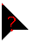
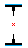
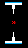
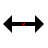

Arrow•Hotspot mouse cursor theme for Windows
 
avoids unnecessary changes in shapes (no hands, circles) and always marks the hotspot

## Introduction

Big triangle-shaped 🮰 arrow without pointless tail and a tiny red dot for the hotspot•, used for most of the basic forms:

  -  links    : signal less obtrusively with a change of tip color as it's often already obvious that you can click a link without the whole extra noise of changing the mouse pointer
  - work/busy: signal less obtrusively with a red filler color, which is especially useful when the work only lasts a fraction of a second, so doesn't warrant a "bigger" signal of changing to a different pointer shape. 
    -  "busy foreground" state is signalled by the whole cursor becoming red 
    -  "work in the background" state is signalled by a red band moving at the top ½ of the arrow 
  -  help: just add a `?` mark inside the cursor
  -   pin/people: attach extra symbols to the click-signalling-color-tipped arrow for the same reason and for consistency

  ⌶ Text : inverted ¦ with a middle gap and a red middle hotspot• dot to indicate position without obscuring text

Others: Added red dot/cross for the hotspot• 

## Install

  🖰Right-click `ArHs¦0 Install.inf` and then click `Install`

## Use

  1. Open `Control Panel` > `Mouse` 
  2. Select the `Pointers` tab
  3. Change your cursor `S̲cheme` `ArHs⋅2`
  4. Click `OK` or `A̲pply` buttons

## Known issues

## Credits

  - maik and his [ml.blau.3](https://www.deviantart.com/maik/art/ml-blau-3-614604903)
  - RealWorld Cursor Editor app
